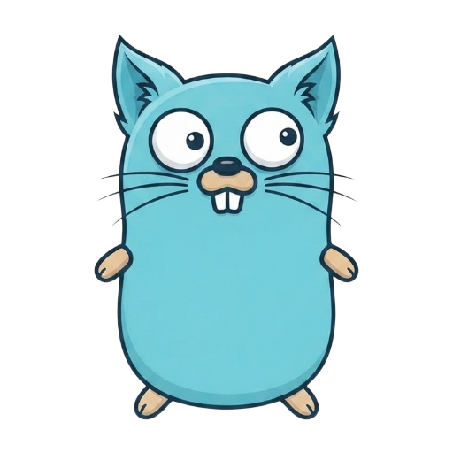

<p align="center">
  
</p>

<h1 align="center">😸 Go Cat 😸</h1>

<p align="center">
  <strong>GIVE AI EXACTLY THE CODE CONTEXT IT NEEDS, NO MORE, NO LESS.</strong>
</p>

<p align="center">
  A fast CLI that scans your project, respects ignore files, and generates AI-friendly Markdown for ChatGPT, Claude, Gemini, Cursor, Copilot, and more.
</p>

# gocat

> Generate AI-ready project context from any codebase.

`gocat` is a fast, lightweight command-line tool that scans your project, respects ignore files, lets you interactively select files and directories, and generates a clean Markdown document optimized for AI coding assistants such as ChatGPT, Claude, Gemini, Cursor, GitHub Copilot, Continue, Cline, Roo Code, and many more.

---

## Why?

Modern AI coding assistants are only as good as the context you provide.

Large projects often contain thousands of files, making it difficult to give an AI exactly the information it needs.

Instead of manually copying files into a prompt, **gocat** lets you:

- 📁 Browse your project interactively
- 🎯 Select only the files and directories you need
- 📝 Generate a clean Markdown document
- 🤖 Paste it directly into your favorite AI assistant

---

## Features

- 📁 Interactive project tree
- 📄 Interactive file & directory selection
- 🚀 Fast recursive filesystem scanning
- 🙈 Respects ignore files
  - `.gitignore`
  - `.dockerignore`
  - `.gocatignore`
  - `.aiignore`
- 📝 AI-friendly Markdown output
- ⚡ Lightweight single binary
- 🌍 Works with any programming language

---

# Installation
## Option 1 — Download a release (Recommended)

Download the latest release for your operating system:

https://github.com/rahmatwaisi/gocat/releases/latest

### Linux

Download:

```text
gocat_<version>_linux_amd64.tar.gz
```

Extract:

```bash
tar -xzf gocat_<version>_linux_amd64.tar.gz
```

Install:

```bash
sudo install -m755 gocat /usr/local/bin/gocat
```

Verify:

```bash
gocat --version
```

---

### Windows

Download:

```text
gocat_<version>_windows_amd64.tar.gz
```

Extract using one of the following:

- Windows Explorer (Windows 11)
- 7-Zip
- WinRAR
- PowerShell

PowerShell:

```powershell
tar -xf gocat_<version>_windows_amd64.tar.gz
```

Move `gocat.exe` to a directory on your `PATH`, for example:

```text
C:\Program Files\gocat\
```

or

```text
C:\Users\<username>\AppData\Local\Microsoft\WindowsApps\
```

Verify:

```powershell
gocat --version
```

---

### macOS

Download:

```text
gocat_<version>_darwin_arm64.tar.gz
```

(Use `darwin_amd64` for Intel Macs.)

Extract:

```bash
tar -xzf gocat_<version>_darwin_arm64.tar.gz
```

Install:

```bash
sudo install -m755 gocat /usr/local/bin/gocat
```

Verify:

```bash
gocat --version
```

---

## Option 2 — Install with Go

```bash
go install github.com/rahmatwaisi/gocat/cmd/gocat@latest
```

Ensure Go's binary directory is on your PATH.

Verify:

```bash
gocat --version
```

---

# Quick Start

Move to your project.

```bash
cd my-project
```

Run:

```bash
gocat
```

The interactive tree appears.

```text
[d1] 📁 cmd/
└── [d2] 📁 gocat/
    └── [1] 📄 main.go

[d3] 📁 internal/
├── [d4] 📁 formatter/
│   ├── [2] 📄 formatter.go
│   └── [3] 📄 markdown.go

[4] 📄 README.md
```

Select files or directories.

```text
1 d3 4
```

`gocat` generates a Markdown document containing the selected source code.

---

# Example Output

````markdown
# cmd/gocat/main.go

```go
package main

func main() {
    ...
}
```

---

# README.md

```markdown
# gocat at your service commander
```
